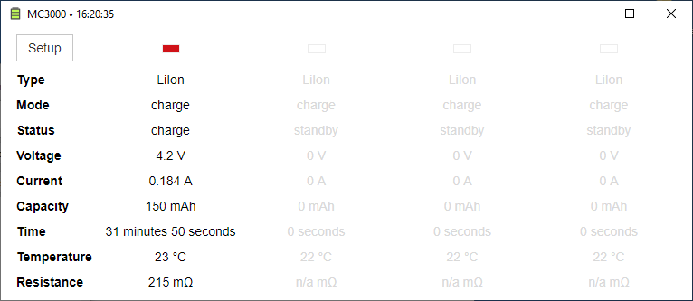

SkyRC MC3000 BLE monitor
========================

Simple application to view status of SkyRC MC3000 over Bluetooth on desktop computers.

Written in Python, maybe cross-platform. 
Windows x64 installer provided in [releases](https://github.com/kolinger/skyrc-mc3000/releases).

Development
-----------

- Requirements
  - Python 3.7
  - `pip install -r requirements.txt`
- Building
  - `pyinstaller --noconfirm pyinstaller.spec`
  - `makensis.exe installer.nsi`
