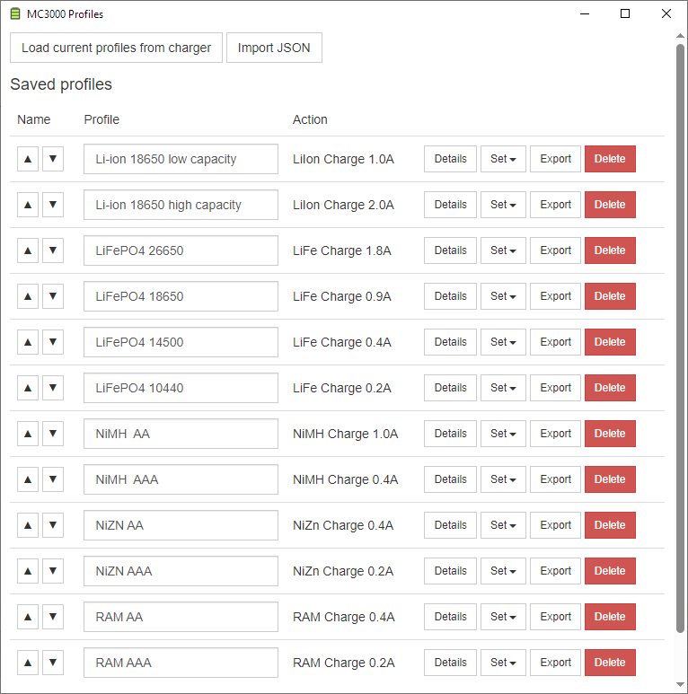

SkyRC MC3000 BLE monitor
========================

Simple application to view status of SkyRC MC3000 over Bluetooth on desktop computers.

New addition is **MC3000 Profiles** application - this application allows you to export/import/share profiles
from your MC3000 over USB cable. This application operates independently of BLE monitor application.

Written in Python, maybe cross-platform with some tweaks.
Windows x64 installer provided in [releases](https://github.com/kolinger/skyrc-mc3000/releases).

**BLE monitor application:**

**Profiles application:**

Development
-----------

- Requirements
  - Python 3.7
  - `pip install -r requirements.txt`
- Building
  - `pyinstaller --noconfirm pyinstaller.spec`
  - `makensis.exe installer.nsi`
