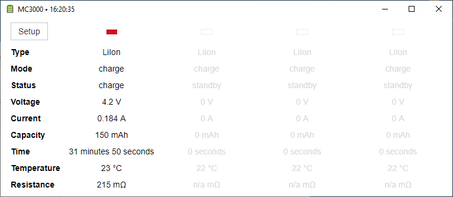
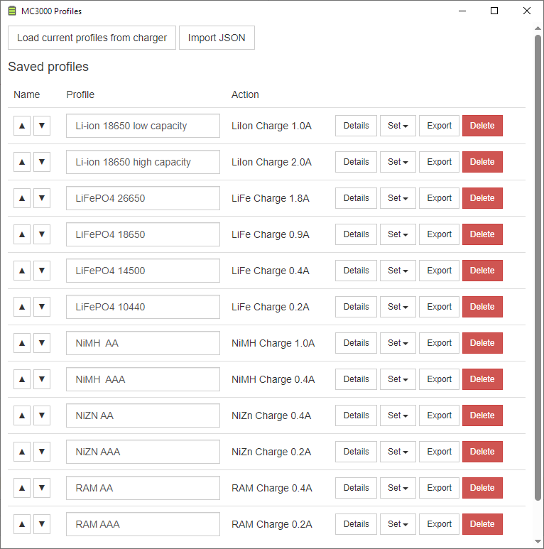

MC3000 / MC5000 BLE Monitor and MC3000 USB Profiles
===================================================

Simple application to view the status of SkyRC MC3000 over Bluetooth on desktop computers 
with an additional application to import/export profiles over USB.

This project provides three different applications:
1) **MC3000 BLE Monitor** - this application shows the current state of the charger
   and provides notifications over Bluetooth (BLE).
2) **MC5000 BLE Monitor** - the same as above but for MC5000.
3) **MC3000 USB Profiles** - this application can import/export profiles over USB.

This project was originally just the **MC3000 BLE Monitor** that's why the structure may be a bit confusing.
Later the **MC3000 USB Profiles** application was added - this application allows you to export/import/share profiles
from your MC3000 over USB cable. This application operates independently of the BLE monitor application. 
This separation exists mainly due to the hardware limitation of the MC3000 where different communication interfaces
don't provide all the functions.

The **MC3000 USB Profiles** application **isn't mean to create nor edit** profiles,
instead it's advised to configure the profiles on the charger itself and then import the existing profile.
Since you can export/import profile as JSON then you may modify the JSON of exported profile to create new 
profiles but be aware that this application doesn't validate the JSON and thus modify only existing profiles with
values that are well known (like the voltage in mV, current in mA, ...) if you supply invalid values or invalid
combinations of valid values to the charger, then bad things may happen to the charger and/or the cells.
It's absolutely not advised to create new profiles or do major changes (like changing a cell type) via JSON - do this
on the charger itself to ensure the profile makes sense as a whole - do only minor changes via JSON.

All apps share the same executable `mc3000ble.exe`.
The executable decided what application to launch by first argument - the value `profiles` 
means **USB Profiles**, `mc5000` means **MC5000 BLE Monitor** anything else means **MC3000 BLE Monitor**. 
The installation creates shortcuts for all the apps.

Written in Python, cross-platform in theory with some tweaks.\
Windows x64 installer provided in [releases](https://github.com/kolinger/skyrc-mc3000/releases).

**BLE Monitor application (for both MC3000 and MC5000):**

**USB Profiles application (only for MC3000):**

Development
-----------

- Requirements
  - Python 3.7
  - `pip install -r requirements.txt`
- Building
  - `pyinstaller --noconfirm pyinstaller.spec`
  - `makensis.exe installer.nsi`
